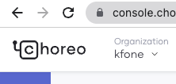

# Welcome to the WSO2 DevRel space 👋

Here you'll find developer **code samples** using the vast variety of [WSO2](https://wso2.com) products and features!

## 💻 Developers

### [Examples](./examples)

The purpose of this new space is to enable the WSO2 community to create and improve your digital experiences.

## 🤝 Contributors

### [Guidelines](./content-guidelines)

We truly value your feedback. Please send your [PRs](https://docs.github.com/en/pull-requests/collaborating-with-pull-requests/proposing-changes-to-your-work-with-pull-requests/about-pull-requests) and issues directly to the projects in this space.

And not only that! If you have a project that you want to share with the WSO2 community, let us know! It could be a great match for this space.

## Other Resources

* [WSO2 Developer Hub](https://wso2.com/developer)
* [WSO2 Discord](https://discord.gg/wso2)
* [WSO2 Official YouTube Channel](https://youtube.com/wso2)
* [WSO2 Twitter](https://twitter.com/WSO2)

> To our developer community, we will represent the company. To the company, we will represent the developer community.

## License

See the exact licensing terms [here](LICENSE)

Unless required by applicable law or agreed to in writing, software distributed under the License is distributed on an "AS IS" BASIS, WITHOUT WARRANTIES OR CONDITIONS OF ANY KIND, either express or implied. See the License for the specific language governing permissions and limitations under the License.


# Kfone - NextGen Web Application

## Summary
This document is a developer guide for building a fully functional secured web application using Asgardeo and Choreo highlighting the code-level modifications. This will be added as the Read Me of the current DevRel repository and all the code-level examples will be linked to this repository.

##
## Table of content

[Introduction](#introduction)

[Kfone architecture](#kfone_architecture)

[Integrating Asgardeo to the Kfone website](#_d8apkit6c2sx)

[Asgardeo React SDK](#asgardeo-react-sdk)

[Connecting Choreo](#connecting-choreo)

[Displaying user account information](#displaying-user-account-information)

[Collecting user interaction data](#collecting-user-interaction-data)


## Introduction
Kfone is a telecommunication company that provides telecom and digital services and products to their customers.

Kfone offers a self-service portal to the customers that include features such as, usage monitoring, managing package subscriptions, and bill payments. Kfone customers will access the self-service portal via the website or mobile.

Kfone has the following business use cases,

Business to Customers (B2C)

- User authentication and authorization at Customer Identity and Access Management (CIAM) 2.0
- UI branding for interfaces presented for login, sign-up, and account recovery flows
- Manage customer's identities and customer profiles securely
- Sending promotional emails based on the user interest

Business to Business (B2B)

- Organizational management
- Business user management
- Integrate corporate IDP for the website

### Kfone architecture

Kfone has integrated several API to accommodate each business use case. The following diagram gives a high-level idea of how Kfone functions at the service level. We will walk \-through all the components in this document.


###
### Integrating Asgardeo to the Kfone website
Kfone website requires a dependable Consumer Identity and Access Management (CIAM) solution that can secure its entire application, services, and users. For that, Kfone uses Asgardeo as the CIAM solution to offload the burden of managing users and handling logins and registrations.

Let's see how we can integrate Asgardeo to the Kfone web application.

As the first step, we have to register the application in Asgardeo. Imagine that this is a [React JS application](https://reactjs.org/). Which is a Single-Page Application (SPA). Follow the steps to register a SPA in Asgardeo to obtain the necessary keys to integrate the application with Asgardeo. You will obtain a client\_id from Asgardeo for the application which will need to be embedded later in the application for integration. Client ID is used for Asgardeo to identify the application uniquely.

1. Register into Asgardeo following this link -  [Asgardeo Sign up](https://asgardeo.io/signup?utm_source=console)
1. Once log-in to Asgardeo, Navigate to Develop -> Applications and create a new application using “+ New Application”

There are a few options to choose from based on the application type. In this particular project, I would choose “Single Page Application”. I would name the application “Kfone”.

Once the application is registered, we can have a unique client\_id on Applications -> **Kfone** in the listing, or under the protocol tab within the application details page.


That's all to configure at Asgardeo. Let's move toward the modifications required in the Kfone application.
#### Asgardeo React SDK
You can use React or Vanilla Javascript SPA SDKs provided by Asgardeo when developing your applications and integrating with Asgardeo. As the Kfone application has been developed with React, the React SDK can easily integrate.

Asgardeo React SDK provides all the CIAM functionalities supported by Asgardeo. It allows React applications to use OpenID Connect (OIDC) authentication with Asgardeo as the CIAM Provider.

Following are the functionalities provided by Asgardeo React SDK,

- Authenticate Users
- Retrieve Authenticated User's Information
- Secure Routes - Check authentication status during the routes and redirect users to login Asgardeo login page if required
- Secure React Components - Check authentication state and decide on a rendering view of the components
- Send Secure HTTP Requests to Asgardeo - A dedicated client-side HTTP caller to call Asgardeo secure APIs
- Silent Sign In - A method to check whether the user is logged in to the application soon as the user visits the application

There are few prerequisites to integrate the SDK,

1. React installed environment
1. Install Asgardeo react sdk


```
npm install @asgardeo/auth-react react-router-dom --save
```

1. A react web application to be secured (Kfone in this case)


Kfone's application/website has the following business flows and web pages for each requirement.

|   Business requirement    |   Page name   |   Access  |
|---------------------------|---------------|-----------|
|Application index/root|App|Public|
|Public landing |HomePage|Public|
|Show the Business information|BusinessPage|Public|
|Usage metering|MyPlan|Private|
|Explore Kfone-facilities|Discover|Private|
|Verifying the mobile phone|PhoneVerification|Private|
|Informative error display|NotFoundErrorPage|Public|
Table -1

In the Kfone application/website, page navigations are happening via react <Route> under the <Router> in App.js.

So, when we want to install a secured gateway, we have to think about a single place that can cover the complete scope of a web application. That is the <Router> at “App.js”. It initializes the business flow and covers all functional paths on the Kfone website.

First import necessary components from the Asgardeo react SDK addition to [react router](https://reactrouter.com/en/main) components,


```
import { 
     AuthProvider,
     SecureRouteWithRedirect
} from '@asgardeo/auth-react';
```

Identifying the business root in this web application, we wrap the <“Router>” by <AuthProvider> derived from asgardeo-react-sdk. We have to import the AuthProvider component from @asgardeo/auth-react at App.js.

```
    <AuthProvider
      config={{ ...appConfig.auth, storage: Storage.WebWorker }}
      plugin={TokenExchangePlugin.getInstance()}>
      <Router>
        <Switch>
          <Route exact path="/" component={HomePage} />
          <Route exact path="/enterprise" component={BusinessPage} />
          <SecureRouteWithRedirect exact path="/my-kfone" component={MyPlan} />
          <SecureRouteWithRedirect exact path="/my-kfone/explore" component={Discover} />
          <SecureRouteWithRedirect exact path="/my-kfone/verify" component={PhoneVerification} />
          <Route path="*" component={NotFoundErrorPage} />
        </Switch>
      </Router>
    </AuthProvider>
```


Once the root component is wrapped with <AuthProvider> component, the useAuthContext() hook can be used anywhere within the application to implement user authentication capabilities in the application. AuthProvider is a React context provider that returns the session state of an authenticated user via the useAuthContext() hook. useAuthContext() usage will explain further in a later section.

There are five properties at [AuthProvider](https://github.com/asgardeo/asgardeo-auth-react-sdk/blob/main/API.md#authprovider), and we have used only two in the Kfone application/website.

1. The mandatory property “**config**” in the type AuthReactConfig provides all the environment-level properties to integrate Asgardeo. This is where the client id and all the URLs should be passed.

The constant named “appConfig” at Config.jsx defines all the properties required by the type [AuthReactConfig](https://github.com/asgardeo/asgardeo-auth-react-sdk/blob/main/API.md#authreactconfig). The values are loaded as environment variables defined in the *.env* file.

```
const appConfig = {
  auth: {
    signInRedirectURL: process.env.REACT_APP_ASGARDEO_LOGIN_CALLBACK_URL ?? '',
    signOutRedirectURL: process.env.REACT_APP_ASGARDEO_LOGOUT_CALLBACK_URL ?? '',
    clientID: process.env.REACT_APP_ASGARDEO_CLIENT_ID ?? '',
    baseUrl: process.env.REACT_APP_ASGARDEO_BASE_URL ?? '',
    scope: ['openid', 'profile', 'email'],
    stsConfig: {
      client_id: process.env.REACT_APP_CHOREO_CLIENT_ID,
      scope: [
        'apim:api_manage',
        'apim:subscription_manage',
        'apim:tier_manage',
        'apim:admin',
        'apim:publisher_settings',
        'environments:view_prod',
        'environments:view_dev',
        'apim:api_generate_key'
      ],
      orgHandle: process.env.REACT_APP_CHOREO_ORGANIZATION
    },
    stsTokenEndpoint: process.env.REACT_APP_CHOREO_TOKEN_ENDPOINT,
    resourceServerURLs: process.env.REACT_APP_BASE_API_ENDPOINT
  },
  myaccountURL: process.env.REACT_APP_MY_ACCOUNT_URL
};
```

As we are using the TokenExchangePlugin in the plugins property, it relies on two configuration values: "stsConfig" and "stsTokenEndpoint". These values are essential for the proper functioning of the plugin. The stsConfig contains the client id of Choreo application as well as the necessary scopes required to interact with the Choreo API, which we will be creating later. Then we also need the Choreo organization to be provided as the "orgHandle".

Then the `stsTokenEndpoint` is the choreo token endpoint which we will be retrieving from the Choreo developer portal.

You may use a different way to load these properties instead of a *.env* file, still, you have to follow the variables defined at AuthReactConfig. This is the only mandatory attribute in AuthProvider. Please refer to [this link](https://github.com/asgardeo/asgardeo-auth-react-sdk/blob/main/API.md#authreactconfig) for more information about the AuthReactConfig component.

1. “**plugin**” is where we can pass any external plugins. We have passed “TokenExchangePlugin” to link Choreo. This will be discussed in detail later.

And then the child component <Router> will contain all the routes of the application. Any public route can use the <Route> component provided by react-router-dom and for any secured route that needs authentication can use <SecureRouteWithRedirect> provided by asgardeo-react-sdk. Further secure routing will be explained below.

Now we have initialized the authentication flow by loading the properties. The next step is to invoke authentication. For this, we have to identify the web pages that contain private and sensitive information. Please refer to the column named “Access” in the table “Table -1”. Now we can call the singIn() function when navigating to these private pages.

In Kfone, we want to keep the user signed in for particular pages until the session expires, hence there is a separate component named “SecureRouteWithRedirect” to check the user session. If the user is not logged in, then it calls the signIn() function. Check SecureRouteWithRedirect.js

```
export const SecureRouteWithRedirect = (props) => {
  const { component, path } = props;
  const { signIn, trySignInSilently } = useAuthContext();

  const callback = () => {
    trySignInSilently()
      .then((response) => {
        if (!response) {
          signIn();
        }
      })
      .catch(() => {
        signIn();
      });
  };

  return <SecureRoute exact path={path} component={component} callback={callback} />;
};
```

singIn() function is provided via useAuthContext() hook, hence we need to import this hook at any place to call singIn().


```
import { useAuthContext } from "@asgardeo/auth-react";
```

The private pages are declared at “SecureRouteWithRedirect” components instead of Route components to accommodate the authentication before navigating to the page.

```
<SecureRouteWithRedirect exact path="/my-kfone" component={MyPlan} />
```

HomePage.jsx

When a user lands on a website, we have to check whether there is an active(non-expired) user session already created. If there exists a legitimate session, no need to sign in again. Kfone-website has handled this scenario by the following code segment using the decoded authenticated token properties returned by the useAuthContext hook in HomePage.jsx.

```
useEffect(() => {
    reRenderCheckRef.current = true;

    (async () => {
      try {
        const now = Math.floor(Date.now() / 1000);
        const decodedIDtoken = await getDecodedIDPIDToken();
        const expiration = decodedIDtoken?.exp;
        if (now < expiration && !query.get('code')) {
          await signIn();
        }
      } catch (error) {
        console.log(error);
      }
    })();
  }, []);
```

Done! We have successfully integrated Asgardeo SDK into our application, so we are eligible to use all the access management facilities provided by Asgardeo such as social login, MFA, and UI branding.

Now we are ready to register a user in Kfone. We have added all the code snippets to accommodate user sign-up.

Kfone offers a user portal that shows usage of the mobile package. A user is required to register his mobile number at Kfone to enable the user portal service at Kfone. Once the registration is complete, the user is prompted for his Kfone mobile number for verification as he is a new user. When the user provides his number, an OTP will be sent to his phone via SMS. The user needs to provide this OTP to continue with the application.


#### Connecting Choreo
Are you going to develop an API from scratch to develop the above? For me, I would rather choose Choreo. Choreo orchestrates the API connection acting as a gateway. Kfone-website requires several APIs to accommodate its functionalities. All these APIs are built on top of Choreo.

Implementing an API in Choreo is a piece of cake; you don’t have to know everything about API development. Try this tutorial on [building an API in Choreo](https://wso2.com/choreo/docs/get-started/tutorials/create-your-first-rest-api/).

Once the API is created,

1. Go to Choreo developer portal (<https://devportal.choreo.dev/>).
1. Visit the API section and add the API created in choreo console.
1. Visit the applications section and create a new application.
1. Then go into the created application.
1. Go to subscriptions and add the api we created above.That means our developer portal app is now subscribing to that api.
1. In the side panel navigate to Production Keys -> OAuth 2.0 tokens and create credentials.
1. Once that is done, copy the client id (Consumer Key) and the token endpoint.
1. After, expand the Advanced Configurations and check the Public Client option.
1. The client id and token endpoint copied in step 5 need to be added in our stsConfig and stsTokenEndpoint configurations.

The “orgHandle” is the organization name in Choreo where we created and published the API.




We used “TokenExchangePlugin” to configure Choreo at App.js hence there is nothing to worry about connecting. We should provide the valid connection configuration values for  “appConfig” in “Config.js”.

Verify the customer's mobile phone number. - Account Verification API

We will implement an API for account verification via the mobile number in Choreo using Twilio API. Following is the API specification.


Once a user is successfully authenticated into Kfone-website, he is navigated to the mobile phone verification page. Then the user should enter his mobile number and get validated via OTP/SMSr. For this, we have to call 2 endpoints(i.e initiatePhoneVerify, verifyPhone) in the Account Verification API. Both of them require the user information extracted from the authenticated token. “httpRequest” function returns the Promise object that contains the API response. We can extract “httpRequest” from the “useAuthContext” hook.

Here we are using the state object to pass values for the mobile verification API. (PhoneVerification.jsx)

```
const decodedIDToken = location.state;
      if (decodedIDToken?.mobileNumberVerified || sessionStorage.getItem('verified')) {
        history.push('/my-kfone');
      }
      setEmail(decodedIDToken?.email);
      setPhone(decodedIDToken?.phone_number);
```

We can keep track of mobile verification action by declaring an item at the SessionStorage named “verified”. This indicates whether the mobile number is verified.


```
const res = await initiatePhoneVerify(email, phone, httpRequest);
```

The endpoint initiatePhoneVerify returns a response with “opt” of the verification action, which we can keep at the SessionStorage to monitor the verification activity. We can remove both “verified” and “opt” items from the SessionStorage right before the user logout.


```
const handleLogout = () => {
    sessionStorage.removeItem('verified');
    sessionStorage.removeItem('otp');
    signOut();
};
```

Similarly, you can call the mobile verification endpoint like below. Please refer api/index.js for more information.

```
 verifyPhone(email, phone, httpRequest)
      .then((res) => {
        setLoading(false);
        sessionStorage.setItem('verified', true);
        history.push('/my-kfone');
      })
      .catch((error) => {
        console.error(error);
      });
 };
```

When the user is successfully registered with Kfone, he can view his package and billing information via Kfone self-service portal.

#### Displaying user account information
Every user expects his account information once registered. Kfone facilitates this service powered by the MyAccount portal via Asgardeo. We have to simply add the configured MyAccount URL to the HTML block. (CustomerPortal.jsx)


```
<NavLinkBlock url="">
    <a href={appConfig.myaccountURL} target="blank" className="flex w-full items-center">
       <AiOutlineUser size={28} className="mr-3" />
       <div className="flex w-full items-start">
          <h3 className="mr-1">My Account</h3>
          <FiExternalLink size={12} />
       </div>
    </a>
</NavLinkBlock>
```


#### Collecting user interaction data
“Explore” flow at Kfone’s website displays all the products and the mobile subscription packages offered. When the user walks through these pages, the journey details are recorded via clicks.


```
<a
   onClick={recordInteraction}
    className="text-white bg-primary hover:bg-primary-600 focus:ring-4 focus:ring-primary-200 font-medium rounded-lg text-sm px-5 py-2.5 text-center dark:text-white  dark:focus:ring-primary-900">
    See Full Plan
</a>
```

Each record is sent to the User Interaction API at Choreo. This API collects user activities. The data collected at this service is helpful for recommendation and marketing purposes.

User registration webhook

Kfone website uses a Hubspot webhook at Choreo to synchronize user information from various events. This webhook is triggered via Asgardeo when a user got registered. The webhook updates event information at “User Interaction API” at Choreo.

